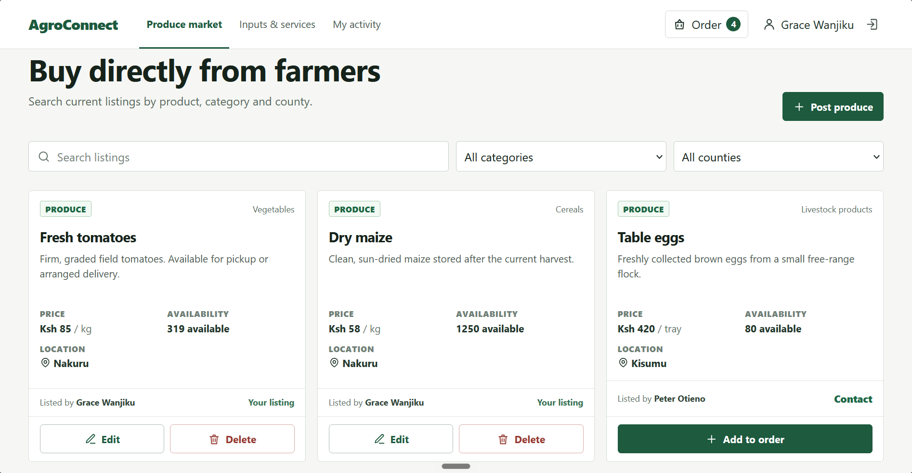

# AgroConnect

AgroConnect is a full-stack digital agricultural marketplace and service platform connecting Kenyan farmers, farm input/service suppliers, and buyers. It provides open, frictionless public discovery for agricultural goods and farm services alongside authenticated workflows for posting harvests, purchasing inputs, tracking orders, and coordinating directly between buyers and sellers.

<p align="center">
  
</p>

---

## Features Matrix

- Register as a farmer, buyer, seller of farm inputs/service provider.
- Browse a catalogue of farm inputs and services.
- List farm produce for sale as a farmer.
- Provide agricultural services and/or inputs.

---

## Technology Stack

- **Frontend**: React 19, Vite 8, React Context API (`AppContext`), Vanilla CSS Custom Properties design system.
- **Backend**: Node.js (ES Modules), Express 5, CORS, JSON body parsing middleware.
- **Database**: SQLite 3 via `better-sqlite3` with foreign key enforcement and transactional inventory decrementing.
- **Security & Auth**: JSON Web Tokens (`jsonwebtoken`), password hashing via `bcryptjs` (salt rounds: 10).
- **Concurrency & Tooling**: `concurrently` (unified dev pipeline), ESLint 10.

---

## Getting Started

### Prerequisites
- Node.js 18 or newer
- npm (v9+)

### Installation
```bash
git clone https://github.com/Jmukami/farmers-agroconnect.git
cd farmers-agroconnect
npm install
```

### Run Development Server
To launch both the Express REST API (port 3001) and Vite React frontend (port 5173) concurrently:
```bash
npm run dev
```

### Default Demonstration Accounts
The database automatically seeds with default demonstration accounts (password: `agroconnect` for all seed users):

| Name | Role | Email | Password | Primary Offering |
| :--- | :--- | :--- | :--- | :--- |
| **Grace Wanjiku** | Farmer | `grace@agroconnect.local` | `agroconnect` | Tomatoes, Dry maize |
| **Peter Otieno** | Farmer | `peter@agroconnect.local` | `agroconnect` | Table eggs, Paddy rice |
| **Rift Farm Supplies** | Supplier | `rift@agroconnect.local` | `agroconnect` | Seeds, Fertiliser, Drip kits |
| **VetCare Kenya** | Supplier | `vetcare@agroconnect.local` | `agroconnect` | Veterinary visits, Soil testing |

---

## Team

Maintained by **Team 6**:
- Abelle Emmanuel
- Mukundi Jochebed Mukami
- Bruce Ouma
- Mark Kage

Repository: [Jmukami/farmers-agroconnect](https://github.com/Jmukami/farmers-agroconnect)
