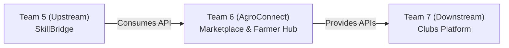

# Team 6

## Team Members:
- Abelle Emmanuel
- Mark Kage
- Bruce Omondi
- Jochebed Mukami

## Github Link
https://github.com/Jmukami/farmers-agroconnect.git

## Project Information:
AgroConnect is a web-based application that helps farmers access quality agricultural inputs, useful agrricultural services, and better farming opportunities. It allows farmers to register, and it provides a farm inputs sections where users can browse agricultural products. Users can then view these inputs in their shopping cart, view the number of items and then proceed to the checkout and verification stage.

### Resource 1: Farmer
- Name of the famer
- Phone number
- County/Location
- Main crops/Livestock

### Resource 2: Farm Input
- Seeds
- Fertilizers
- Supplements
  
### Resource 3: Cart
Chosen items

### Farmer actions
1. Register as a farmer
2. Enter their phone number
3. Enter their county/location
4. Enter their main crops/livestock
5. Submit registration

### Farm input actions
- View/browse farm inputs
- View the name of an input
- View the price of an input
- Add a farm input to the cart

### Cart actions 
- Add item to cart
- View cart
- View number of items
- View total price
- Proceed to checkout

### Ring position:
