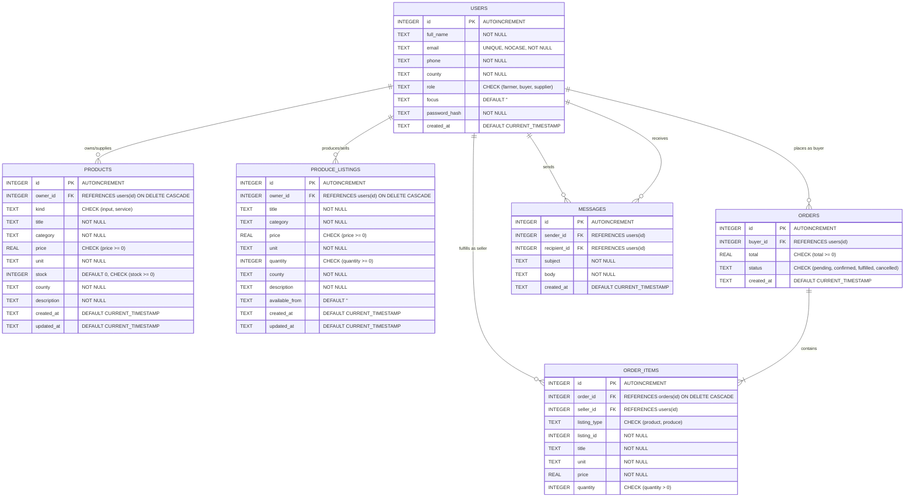

# AgroConnect Database Schema Reference

AgroConnect utilizes **SQLite 3** managed via `better-sqlite3`. The database file is located at `server/data/agroconnect.db` and is auto-initialized and seeded on first startup.

## 1. Entity-Relationship Diagram (ERD)



---

## 2. Table Specifications

### 2.1 `users`
Stores all account profiles.
```sql
CREATE TABLE IF NOT EXISTS users (
  id INTEGER PRIMARY KEY AUTOINCREMENT,
  full_name TEXT NOT NULL,
  email TEXT NOT NULL UNIQUE COLLATE NOCASE,
  phone TEXT NOT NULL,
  county TEXT NOT NULL,
  role TEXT NOT NULL CHECK(role IN ('farmer', 'buyer', 'supplier')),
  focus TEXT DEFAULT '',
  password_hash TEXT NOT NULL,
  created_at TEXT NOT NULL DEFAULT CURRENT_TIMESTAMP
);
```

| Column | Type | Constraints | Description |
| :--- | :--- | :--- | :--- |
| `id` | `INTEGER` | `PRIMARY KEY AUTOINCREMENT` | Unique identifier for user |
| `full_name` | `TEXT` | `NOT NULL` | User's displayed legal/trading name |
| `email` | `TEXT` | `NOT NULL UNIQUE COLLATE NOCASE` | Unique login email |
| `phone` | `TEXT` | `NOT NULL` | Phone number for contact |
| `county` | `TEXT` | `NOT NULL` | Geographic location in Kenya |
| `role` | `TEXT` | `CHECK(role IN ('farmer','buyer','supplier'))` | Role controlling platform permissions |
| `focus` | `TEXT` | `DEFAULT ''` | Farm crops, livestock, or business focus |
| `password_hash`| `TEXT` | `NOT NULL` | Bcrypt hashed password (cost: 10) |
| `created_at` | `TEXT` | `DEFAULT CURRENT_TIMESTAMP` | Timestamp of account creation |

---

### 2.2 `products`
Stores farm inputs (seeds, fertilizer, equipment) and practical farm services (veterinary, soil testing).
```sql
CREATE TABLE IF NOT EXISTS products (
  id INTEGER PRIMARY KEY AUTOINCREMENT,
  owner_id INTEGER NOT NULL REFERENCES users(id) ON DELETE CASCADE,
  kind TEXT NOT NULL CHECK(kind IN ('input', 'service')),
  title TEXT NOT NULL,
  category TEXT NOT NULL,
  price REAL NOT NULL CHECK(price >= 0),
  unit TEXT NOT NULL,
  stock INTEGER NOT NULL DEFAULT 0 CHECK(stock >= 0),
  county TEXT NOT NULL,
  description TEXT NOT NULL,
  created_at TEXT NOT NULL DEFAULT CURRENT_TIMESTAMP,
  updated_at TEXT NOT NULL DEFAULT CURRENT_TIMESTAMP
);
```

---

### 2.3 `produce_listings`
Stores fresh produce listings posted by farmers ready for harvest or collection.
```sql
CREATE TABLE IF NOT EXISTS produce_listings (
  id INTEGER PRIMARY KEY AUTOINCREMENT,
  owner_id INTEGER NOT NULL REFERENCES users(id) ON DELETE CASCADE,
  title TEXT NOT NULL,
  category TEXT NOT NULL,
  price REAL NOT NULL CHECK(price >= 0),
  unit TEXT NOT NULL,
  quantity INTEGER NOT NULL CHECK(quantity >= 0),
  county TEXT NOT NULL,
  description TEXT NOT NULL,
  available_from TEXT DEFAULT '',
  created_at TEXT NOT NULL DEFAULT CURRENT_TIMESTAMP,
  updated_at TEXT NOT NULL DEFAULT CURRENT_TIMESTAMP
);
```

---

### 2.4 `orders`
Master order record representing a checkout transaction.
```sql
CREATE TABLE IF NOT EXISTS orders (
  id INTEGER PRIMARY KEY AUTOINCREMENT,
  buyer_id INTEGER NOT NULL REFERENCES users(id),
  total REAL NOT NULL CHECK(total >= 0),
  status TEXT NOT NULL DEFAULT 'pending' CHECK(status IN ('pending', 'confirmed', 'fulfilled', 'cancelled')),
  created_at TEXT NOT NULL DEFAULT CURRENT_TIMESTAMP
);
```

---

### 2.5 `order_items`
Individual line items inside an order mapped to specific sellers for multi-vendor support.
```sql
CREATE TABLE IF NOT EXISTS order_items (
  id INTEGER PRIMARY KEY AUTOINCREMENT,
  order_id INTEGER NOT NULL REFERENCES orders(id) ON DELETE CASCADE,
  seller_id INTEGER NOT NULL REFERENCES users(id),
  listing_type TEXT NOT NULL CHECK(listing_type IN ('product', 'produce')),
  listing_id INTEGER NOT NULL,
  title TEXT NOT NULL,
  unit TEXT NOT NULL,
  price REAL NOT NULL,
  quantity INTEGER NOT NULL CHECK(quantity > 0)
);
```

---

### 2.6 `messages`
In-app buyer-seller direct messages.
```sql
CREATE TABLE IF NOT EXISTS messages (
  id INTEGER PRIMARY KEY AUTOINCREMENT,
  sender_id INTEGER NOT NULL REFERENCES users(id),
  recipient_id INTEGER NOT NULL REFERENCES users(id),
  subject TEXT NOT NULL,
  body TEXT NOT NULL,
  created_at TEXT NOT NULL DEFAULT CURRENT_TIMESTAMP
);
```

---

## 3. Pre-Seeded Default Dataset

When the server starts with an empty database, it populates initial demonstration data:

| Name | Role | Email | Password | Location | Specialization / Offerings |
| :--- | :--- | :--- | :--- | :--- | :--- |
| **Grace Wanjiku** | Farmer | `grace@agroconnect.local` | `agroconnect` | Nakuru | Fresh tomatoes, Dry maize |
| **Peter Otieno** | Farmer | `peter@agroconnect.local` | `agroconnect` | Kisumu | Table eggs, Paddy rice |
| **Rift Farm Supplies** | Supplier | `rift@agroconnect.local` | `agroconnect` | Nakuru | Hybrid maize seed, Organic fertiliser, Drip irrigation kit, Feed concentrate |
| **VetCare Kenya** | Supplier | `vetcare@agroconnect.local` | `agroconnect` | Kiambu | Livestock health visit, Soil testing service |
